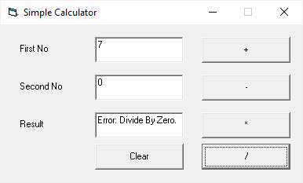

# Simple Calculator

Sample Applications to demonstrate Microsoft Technologies.

1.	SimpleCalculator.Vb6 – VBW, Visual Studio 6.0
2.	SmipleCalculator.Mfc – VC++, MFC, Visual Studio 2008
3.	SmipleCalculator.Wrt – VB.Net, WinRT, Visual Studio 2013
4.	SmipleCalculator.UWP – C#, UWP, Visual Studio 2015
5.	SmipleCalculator.WinUI3 – C#, WinUI3, Visual Studio 2019
